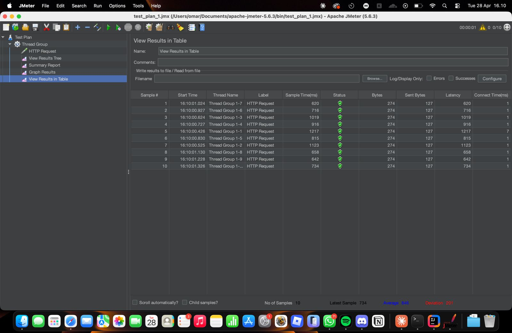
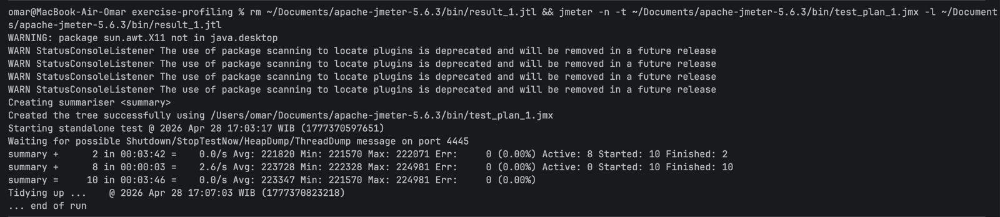
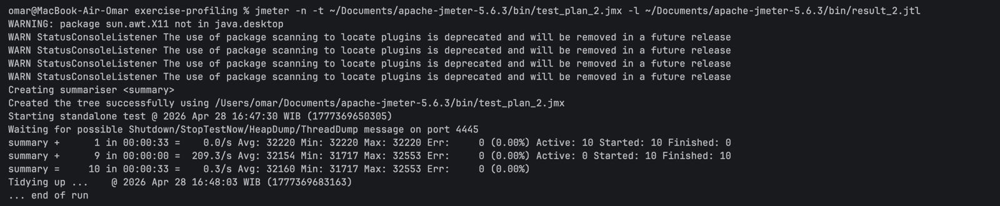
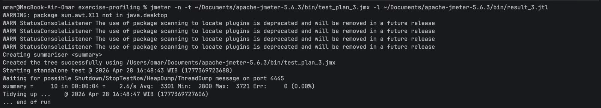
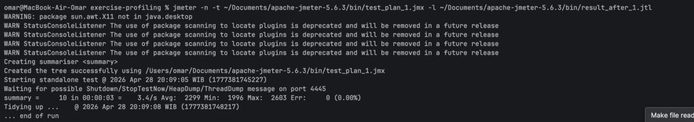
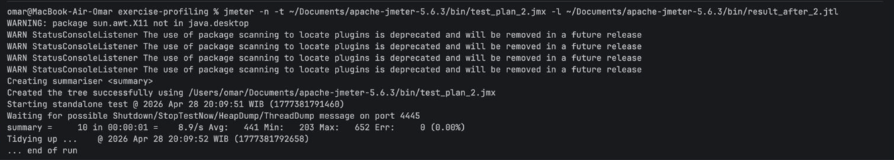
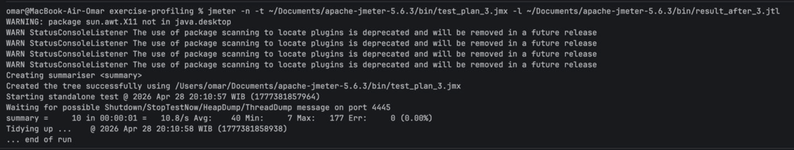

# Exercise Profiling

## Performance Testing Results

Before Optimization

/all-student

/all-student-name

/highest-gpa

Command Line Results (Before)

After Optimization

Command Line Results (After)

Kesimpulan
Setelah melakukan optimasi pada kode, terjadi peningkatan performa 
yang signifikan pada ketiga endpoint. Endpoint /all-student mengalami 
peningkatan dari sekitar 223.000ms menjadi 2.299ms (peningkatan sekitar 99%). 
Endpoint /all-student-name meningkat dari sekitar 18.000ms menjadi 441ms 
(peningkatan sekitar 97%). Endpoint /highest-gpa meningkat dari sekitar 640ms menjadi 
40ms (peningkatan sekitar 94%).

Optimasi utama yang dilakukan adalah menghilangkan masalah N+1 
query pada getAllStudentsWithCourses dengan menggunakan 
studentCourseRepository.findAll() secara langsung, 
mengganti full table scan pada findStudentWithHighestGpa dengan query 
di level database menggunakan findTopByOrderByGpaDesc(), serta 
mengganti String concatenation dengan StringBuilder pada joinStudentNames.

Refleksi

1. What is the difference between the approach of performance testing with JMeter and profiling with IntelliJ Profiler in the context of optimizing application performance?

JMeter mengukur performa dari luar, mensimulasikan pengguna asli 
yang mengakses endpoint dan mengukur response time. 
JMeter memberi tahu kita bahwa ada masalah, 
tetapi tidak menunjukkan di mana masalahnya. 
Sedangka IntelliJ Profiler bekerja dari dalam, menampilkan 
penggunaan CPU dan memori per method, sehingga dapat mengidentifikasi 
dengan tepat kode mana yang menyebabkan bottleneck

2. How does the profiling process help you in identifying and understanding the weak points in your application?

Profiling menampilkan flame graph dan daftar method 
dan waktu eksekusinya, sehingga memudahkan identifikasi 
method mana yang paling banyak menggunakan CPU. 
Tanpa profiling, mengidentifikasi bottleneck hanya bisa dilakukan dengan perkiraan

3. Do you think IntelliJ Profiler is effective in assisting you to analyze and identify bottlenecks in your application code?

Ya, IntelliJ Profiler sangat efektif karena menyediakan 
representasi visual seperti flame graph yang menunjukkan 
hierarki pemanggilan method dan waktu yang dihabiskan di 
setiap method, sehingga identifikasi bottleneck menjadi lebih mudah

4. What are the main challenges you face when conducting performance testing and profiling, and how do you overcome these challenges?

Tantangan utama adalah memastikan kondisi pengujian 
yang konsisten, run pertama JVM selalu lebih lambat karena 
JIT compilation belum optimal. Hal ini diatasi dengan 
menjalankan aplikasi beberapa kali sebelum melakukan 
pengukuran, seperti yang disebutkan dalam modul

5. What are the main benefits you gain from using IntelliJ Profiler for profiling your application code?

IntelliJ Profiler menyediakan data penggunaan 
CPU dan memori per method secara detail, flame 
graph secara visual, serta tampilan perbandingan 
antar sesi profiling, sehingga memudahkan verifikasi 
bahwa optimasi yang dilakukan benar-benar efektif

6. How do you handle situations where the results from profiling with IntelliJ Profiler are not entirely consistent with findings from performance testing using JMeter?

JMeter mengukur response time end-to-end termasuk 
latensi jaringan dan database, sementara IntelliJ Profiler lebih berfokus
pada CPU time. Ketidakkonsistenan dapat terjadi akibat I/O bottleneck 
yang tidak terlihat dalam CPU profiling. Dalam case seperti ini, 
kedua tools harus digunakan bersama untuk mendapatkan gambaran yang lengkap

7. What strategies do you implement in optimizing application code after analyzing results from performance testing and profiling? How do you ensure the changes you make do not affect the application's functionality?

Strategi utama yang diterapkan adalah menghilangkan masalah N+1 query, 
mengubah komputasi ke level database, dan menggunakan struktur 
data yang efisien seperti StringBuilder. Fungsionalitas diverifikasi 
dengan menjalankan kembali pengujian JMeter dan memastikan semua response 
mengembalikan status 200 dengan data yang benar.